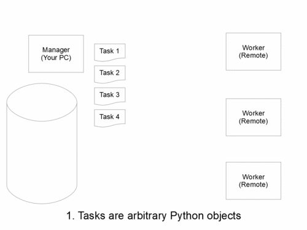

# oden
Easy distributed computation (with no communication) just by one Python file

## Abstract

## Features
- Easy to write tasks: All (pickleable) Python objects can be used as tasks.  You don't have to learn new DSLs to write tasks.
- Easy to setup (?): Add oden.py in your project, fill in the placeholder in oden.py, copy the project in remote machines, and run oden.py in worker mode.
- Easy network setting: Opening 8080 of remote machines (only) to your PC is enough.  No need for tunneling or something.
- Easy to analyze the results: The results are saved in pickle files.  No need to write serializers nor parsers of the results.
- Easy to debug: The exceptions in the remote machines are sent to your PC and the task is skipped.
- Scheduling is supported: Even if the number of your tasks is larger than the number of remote machines, the tasks are automatically distributed.
- Resuming is supported: If some tasks fail because of exceptions or other errors, you can restart the failed tasks by skipping the succeeded tasks.

## Requirements
- Python3
- [flask](http://flask.pocoo.org/)
- [requests](http://docs.python-requests.org/en/master/)

## Usage
(An example comes later.  Reading it can be easier.)
1. Copy [oden.py](https://raw.githubusercontent.com/ashiato45/oden/master/oden.py) in your project.
2. Fill in the place holder between `------ User write below ------` and `------ User write above ------`.
    1. `hosts` is a string of the hostnames of remote machines separated by breaks.  In the default setting, it reads the hosts from `hosts.txt`.
    2. `name` is the name of your project of distributed computation.  The results are saved with the names of `(name)(number)_(date).pickle`.
    3. `interval_polling` is the interval of polling to retrive the results from the remote machines.  The unit is second.
    4. `timeout` is the timeout in the HTTP request to communicate remote machines.  The unit is second.
    5. `make_tasks()` has to return a list of tasks.  Any (pickleable) Python objects can be used as tasks.
    6. `calc(task)` takes a task and returns the result.  It can return any (pickleable) Python objects.  This function is called in the remote machines.
    7. (optional) `handle_finish_machine(uri, name)` is called when a remote machine has no remaining task because of running out of the tasks.
    8. (optional) `handle_finish_tasks()` is called when all the tasks are processed.
    9. (optional) `show_status()` returns a string.  The return value is shown when you access the remote machine by `http://(hostname):8080`.
3. Copy whole your project to remote machines.
4. Run `python oden.py worker` on the remote machines.  The web servers to run the computations start.  Here 8080 port of the remote machines has to be open to your PC.  ⚠️ Opening 8080 port to the world is insecure.  Oden is designed to communicate only with your PC, so it is not designed to be secure...
5. Run `python oden.py manager` on your PC.  The distribution of the tasks starts!  If all the tasks are consumed, it stops.
6. The results are saved in pickle files of name `(name)(number)_(date).pickle`.  Each file contains a dictionary whose keys are `task` and `result`.  The value of `result` is a *pickled* result for the task `task`, so you have to unpickle the value of `result` by `pickle.loads`.
7. (optional) If there is something wrong in the computation and a task fails, the stacktrace is sent to your PC and it appears on the log.  If fixing your script to handle the error does not affect the succeeded result, you can restart the computation only for the failed tasks.
    1. Fix your script.
    2. Stop `oden.py` in the remote machines.  Running `killall python` is a good idea.
    3. Start `oden.py` by `python oden.py worker` in the remote machines.
    4. Run `python oden.py resume` on your PC.  It skips the succeeded tasks by checking the result files starts from the `name` and starts to distribute the failed tasks.

## Example
Alice wants to know the performance of `sort` built in Python and planned a experiment below:
> For each l = 10000, 20000,..., 100000, Alice makes 10 random lists of length l (in total 100 lists) and measure the time to sort them.
> After that, she calculates the average of 10 results for each l.
1. Make a project directory `alice_sort_test`.  
2. Copy [oden.py](https://raw.githubusercontent.com/ashiato45/oden/master/oden.py) in `alice_sort_test` and fill the placeholders like [oden_sample.py](https://github.com/ashiato45/oden/blob/master/oden_sample.py).  `make_tasks()` mades the random lists above.  `calc(task)` sorts the list `task` and measure the time.  Here she unintentionally made a bug that cause an Exception in 10%.  Let's see what happens later.  `handle_finish_machine(uri, name)` and `handle_finish_tasks()` are set to invoke [Slack Incoming Webhook](https://api.slack.com/incoming-webhooks) to notify the end of the tasks.  It would notify her the end of her experiments and let her stop the AWS machine early.  `show_status()` is set to show the content of `log.txt`.  She will output the logs of Oden on the AWS machines to `log.txt` later.
3. Start 3 AWS machines of t2.micro by [vagrant](https://www.vagrantup.com/), [vagrant-aws](https://github.com/mitchellh/vagrant-aws) and `Vagrantfile` ([Vagrantfile_sample](https://github.com/ashiato45/oden/blob/master/Vagrantfile_sample)) in `alice_sort_test`.  
The security group `for_alice` specified in `Vagrantfile` has to allow accesses via 8080 port (see [I host a website on an EC2 instance. How do I allow my users to connect on HTTP (80) or HTTPS (443)?](https://aws.amazon.com/jp/premiumsupport/knowledge-center/connect-http-https-ec2/)).
Here, the environment variables `AWS_ACCESSKEY_ID` and `AWS_SECRET_ACCESS_KEY` are properly set.
Typing `vagrant up --provider=aws` would start 3 AWS machines.
4. Make the list of the AWS machines `hosts.txt` by `vagrant ssh-config | grep HostName | awk '{print $2}' > hosts.txt`
5. Copy file, set up appropriate environments and start `python oden.py worker` so that its log is forwarded to `log.txt` by [ansible](https://www.ansible.com/) and an ansible playbook `test.yml` ([test.yml](https://github.com/ashiato45/oden/blob/master/test.yml)).  Typing `ansible-playbook -i hosts.txt test.yml -u ubuntu --private-key=alice.pem` does these works.
6. Run `python oden.py manager` and wait for the end.
7. Some tasks are properly processed but some failed because of the bug in 2.  Alice noticed the cause and modified `make_tasks()` on Alice's PC.
8. Run `ansible-playbook -i hosts.txt test.yml -u ubuntu --private-key=alice.pem` again.  This operation copies the updated files from Alice's PC to the AWS machines, halts oden in the AWS machines and starts oden again (the installations are skipped).
9. Run the experiments of the failed tasks by `python oden.py resume`.
10. Alice analyze the results by a script [read_samples.py](https://github.com/ashiato45/oden/blob/master/read_samples.py).  It lists the result files by `pathlib.Path(".").glob("{0}*.pickle".format("sample"))` and processes the results.
